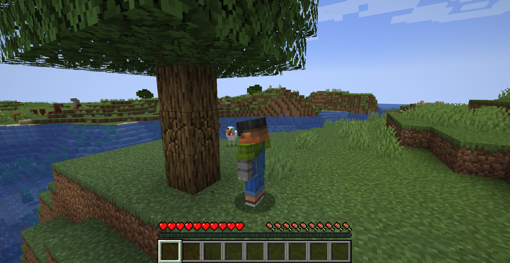
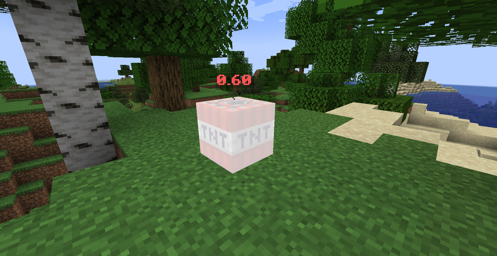

# BattleSense

**Master your surroundings.** BattleSense is a lightweight Fabric client utility designed to give you the tactical edge in PvP and survival. It enhances your situational awareness with a decoupled Freelook camera and precise TNT fuse timers.

## Features

### 1. 360° Freelook
Gain complete situational awareness without breaking your stride. Hold the designated key (Default: `Left Alt`) to decouple your camera from your player's movement.
* **Look Behind You:** Scout for enemies or obstacles while sprinting forward.
* **Seamless Integration:** Your player continues moving in the original direction regardless of where you look.
* **Client-Side Only:** Works on multiplayer servers without requiring server-side installation.

---

### 2. Visual TNT Timer
Never guess when an explosion is coming. Primed TNT entities now display a high-visibility floating countdown timer above them.
* **Precise Timing:** Displays the exact fuse time remaining in seconds (e.g., `3.50s`).
* **Dynamic Urgency Colors:** The text color changes instantly to warn you of the danger level:
    * 🟢 **Green:** Safe (> 2.0s)
    * 🟡 **Yellow:** Caution (< 2.0s)
    * 🔴 **Red:** DANGER (< 1.0s) - **RUN!**

---